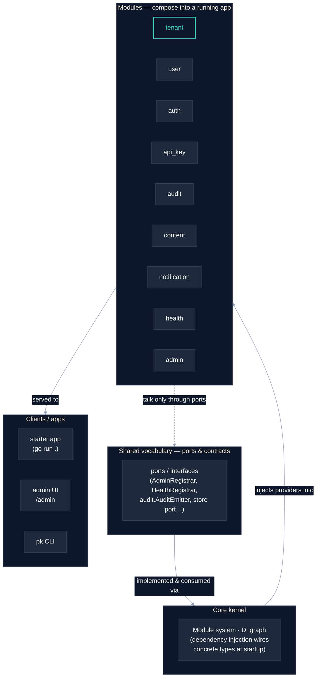

# PlatformKit — Launch Image Prompt-Specs

Copy-paste-ready specifications for generating the four launch images via
[fal.ai](https://fal.ai). Each block is self-contained: the AI prompts need no
editing, and the HTML/CSS/Mermaid/SVG snippets are complete and use only system
fonts (nothing to install).

**Positioning (from `launch/NARRATIVE.md` — do not contradict):**

- Wordmark: **PlatformKit**
- One-liner: **An open-source Go backend for multi-tenant SaaS**
- License: Apache-2.0. Pure Go — runs locally in one command (`go run .`).
- Audience: Go devs / AI builders / Show HN. Voice: plain-spoken senior engineer.

---

## Shared style block (reuse across every asset)

**Aesthetic north star:** clean, calm, technical, developer-credible. The
restrained look of well-designed Go / infrastructure OSS projects. NOT
glossy-SaaS.

**Palette (specific hex):**

| Role | Hex | Notes |
|------|-----|-------|
| Ink / deep slate (primary bg + text) | `#0F172A` | slate-900, the "dark" base |
| Surface slate (panels, lines) | `#1E293B` | slate-800 |
| Hairline / borders | `#334155` | slate-700 |
| Muted text | `#94A3B8` | slate-400 |
| Off-white (light bg + light text) | `#F8FAFC` | slate-50 |
| **Accent — muted teal** | `#2DD4BF` | restrained, used sparingly |
| Accent (alt — muted indigo) | `#818CF8` | swap in if teal feels too "brand-y" |

Use **one** accent only, applied sparingly (a single node, a single underline).
Never two accents in one asset.

**Type vibe:** monospace / grotesk. In all snippets we use the system stacks so
nothing extra installs:

- Mono: `ui-monospace, "SF Mono", "Cascadia Code", "JetBrains Mono", Menlo, Consolas, monospace`
- Grotesk/sans: `system-ui, -apple-system, "Segoe UI", Roboto, "Helvetica Neue", Arial, sans-serif`

**Reusable negative-prompt baseline** (append to every AI prompt's negative field):

```
no gradients, no 3D blobs, no glossy reflections, no stock-photo people, no fake UI screenshots, no neon, no lens flare, no clutter, no AI-art watermark, no signature, no logo, no garbled text, no random letters
```

**General fal.ai text caveat:** diffusion models render long/legible text
poorly. Treat any AI image as a *background only* — never trust a model to
spell "PlatformKit" or the one-liner. All load-bearing text in this kit comes
from the HTML/CSS, SVG, or Mermaid snippets, which are pixel-deterministic.

---

## Asset 1 — OG / social card

**Purpose:** The highest-leverage image. This is what unfurls on Hacker News,
X/Twitter, LinkedIn, and Slack/Discord link previews. Must legibly show the
wordmark **PlatformKit** and the one-liner **An open-source Go backend for
multi-tenant SaaS**.

**Exact dimensions:** 1200 × 630 px (the standard `og:image` size).

**Suggested fal.ai model (for the background ONLY):** `fal-ai/flux/dev`
— fast, strong at abstract technical textures. (`fal-ai/flux-pro/v1.1` if you
want higher fidelity.) **Do not ask the model to render any text** — FLUX cannot
reliably spell the wordmark or one-liner at this size.

### RECOMMENDED reliable path — HTML/CSS card (screenshot at 1200×630)

This renders the exact card deterministically. Save as `og-card.html`, open in a
browser at a 1200×630 viewport, and screenshot. Headless one-liner if you have
Chrome installed:

```bash
chromium --headless --screenshot=og-card.png --window-size=1200,630 --hide-scrollbars og-card.html
# or: google-chrome / "Microsoft Edge" with the same flags
```

```html
<!DOCTYPE html>
<html lang="en">
<head>
<meta charset="utf-8" />
<style>
  html, body { margin: 0; padding: 0; }
  .card {
    width: 1200px;
    height: 630px;
    box-sizing: border-box;
    background: #0F172A;
    /* faint hairline grid — calm, technical, not glossy */
    background-image:
      linear-gradient(to right, rgba(51,65,85,0.25) 1px, transparent 1px),
      linear-gradient(to bottom, rgba(51,65,85,0.25) 1px, transparent 1px);
    background-size: 48px 48px;
    color: #F8FAFC;
    display: flex;
    flex-direction: column;
    justify-content: center;
    padding: 96px 88px;
    font-family: system-ui, -apple-system, "Segoe UI", Roboto, "Helvetica Neue", Arial, sans-serif;
    position: relative;
  }
  .eyebrow {
    font-family: ui-monospace, "SF Mono", "Cascadia Code", "JetBrains Mono", Menlo, Consolas, monospace;
    font-size: 22px;
    letter-spacing: 0.18em;
    text-transform: uppercase;
    color: #94A3B8;
    margin-bottom: 28px;
  }
  .wordmark {
    font-size: 104px;
    font-weight: 700;
    letter-spacing: -0.03em;
    line-height: 1.0;
    margin: 0 0 28px 0;
  }
  .wordmark .dot { color: #2DD4BF; }
  .tagline {
    font-size: 40px;
    font-weight: 400;
    line-height: 1.25;
    color: #E2E8F0;
    max-width: 920px;
    margin: 0;
  }
  .accentbar {
    width: 88px;
    height: 6px;
    background: #2DD4BF;
    border-radius: 3px;
    margin-top: 40px;
  }
  .footer {
    position: absolute;
    bottom: 56px;
    left: 88px;
    right: 88px;
    display: flex;
    justify-content: space-between;
    font-family: ui-monospace, "SF Mono", "Cascadia Code", "JetBrains Mono", Menlo, Consolas, monospace;
    font-size: 22px;
    color: #94A3B8;
  }
</style>
</head>
<body>
  <div class="card">
    <div class="eyebrow">Open source &middot; Apache-2.0</div>
    <h1 class="wordmark">PlatformKit<span class="dot">.</span></h1>
    <p class="tagline">An open-source Go backend for multi-tenant SaaS.</p>
    <div class="accentbar"></div>
    <div class="footer">
      <span>$ go run .</span>
      <span>github.com/septagon-dev/platformkit</span>
    </div>
  </div>
</body>
</html>
```

### AI background prompt (optional — generate, then overlay the text above)

If you want a richer texture than the CSS grid, generate a *text-free*
background with FLUX at 1216×640 (closest FLUX-friendly aspect; downscale/crop to
1200×630), then place it behind the `.card` content (set it as `background-image`
and dim it with `rgba(15,23,42,0.82)` so the text stays legible).

> Prompt:
> `Minimal abstract technical background, deep slate ink color #0F172A, a faint thin-line orthogonal grid and a few subtle node-and-edge graph connections in slate gray, one restrained muted teal accent line, flat 2D, no perspective, calm engineering aesthetic, lots of negative space, matte finish, evokes a software dependency graph, dark background, vector-clean`

> Negative prompt:
> `text, words, letters, numbers, no gradients, no 3D blobs, no glossy reflections, no stock-photo people, no fake UI screenshots, no neon, no lens flare, no clutter, no AI-art watermark, no signature, no logo, no garbled text, no random letters`

**Output filename + target path:** `platformkit/launch/images/og-card.png`
(1200×630). Keep the source HTML at `platformkit/launch/images/og-card.html`.

**Notes / fallback:** The HTML/CSS path is the recommended, reliable one — it
guarantees correct text. The accent dot/bar uses teal `#2DD4BF`; swap to indigo
`#818CF8` in the two `.dot`/`.accentbar` rules if preferred. If you cannot run
headless Chrome, open the HTML in any browser, set the window to ~1200×630, and
take an OS screenshot, then crop. Set the meta tag in your README/site as
`<meta property="og:image" content=".../og-card.png">` plus
`<meta name="twitter:card" content="summary_large_image">`.

---

## Asset 2 — Hero image (README top)

**Purpose:** Front-door visual at the top of the README. Restrained, technical,
abstract — evokes composable modules and a dependency graph without literal
clip-art. **No text required in the image.**

**Exact dimensions:** 1280 × 640 px (2:1). Generate at 1280×640 directly.

**Suggested fal.ai model:** `fal-ai/flux/dev` (clean abstract work, fast). Use
`fal-ai/flux-pro/v1.1` for a higher-fidelity final. Since the hero needs no text,
diffusion text caveats do not apply here.

**Prompt:**

```
Abstract technical illustration of composable software modules connecting into a system, on a deep slate ink background color #0F172A. A handful of rounded rectangular nodes arranged in loose columns, joined by thin straight connector lines forming a clean dependency graph from left to right. Nodes and lines in muted slate gray (#334155, #94A3B8). Exactly one node and one connector highlighted in a single restrained muted teal (#2DD4BF). Flat 2D, orthographic, no perspective, generous negative space, matte finish, precise and calm, the restrained aesthetic of a well-designed Go infrastructure open-source project. Subtle faint grid in the background. Minimalist, engineering-grade, vector-clean.
```

**Negative prompt:**

```
text, words, letters, numbers, logos, no gradients, no 3D blobs, no glossy reflections, no stock-photo people, no fake UI screenshots, no neon, no lens flare, no clutter, no AI-art watermark, no signature, no garbled text, no random letters, photorealism, busy composition, rainbow colors, drop shadows
```

**Output filename + target path:** `platformkit/launch/images/hero.png` (1280×640).

**Notes / fallback:** Keep it sparse — if the model returns a busy/cluttered
result, add `, only 5 nodes, very minimal` to the prompt and regenerate.
Single-accent rule: if two+ teal areas appear, add `, only one teal accent`.
If AI hero feels off-brand, the CSS grid background from Asset 1 (without the
text) is a perfectly acceptable, fully deterministic hero. Swap teal for indigo
`#818CF8` by replacing the hex in the prompt.

---

## Asset 3 — Architecture diagram (core → modules → clients)

**Purpose:** Show how a PlatformKit app is composed: shared vocabulary → core
kernel → modules (communicating only through ports/interfaces, wired by
dependency injection) → clients/apps.

**Recommendation: use diagram-as-code (Mermaid). AI generation is NOT
recommended for this asset** — a garbled or inaccurate diagram destroys
developer credibility, and diffusion models cannot render the labels correctly.

**Exact dimensions:** Mermaid renders to crisp SVG at any size; export at ~1600px
wide for README use (it scales losslessly).

### RECOMMENDED — Mermaid (paste into any Mermaid renderer or a GitHub `mermaid` code fence)



**Light/dark note:** The `init` block above is tuned for a **dark** README
(slate ink background). For a **light** README, swap these values in the `init`:
`'primaryColor':'#F8FAFC'`, `'primaryTextColor':'#0F172A'`,
`'clusterBkg':'#F8FAFC'`, `'lineColor':'#334155'`, `'edgeLabelBackground':'#F8FAFC'`,
and change the `accent` classDef to `fill:#F8FAFC,color:#0D9488,stroke:#0D9488`
(a slightly darker teal that reads on white). GitHub renders Mermaid in a
```` ```mermaid ```` fence automatically and adapts reasonably to the reader's
theme, so a single dark-tuned block is usually fine to ship.

**Output filename + target path:** Prefer embedding the live ```` ```mermaid ````
fence directly in the README. For a static export, save SVG to
`platformkit/launch/images/architecture.svg` (export via
[mermaid.live](https://mermaid.live) → SVG, or `mmdc -i architecture.mmd -o architecture.svg`).

**Notes / fallback (AI — only if you insist, NOT recommended):** one-line prompt
for `fal-ai/flux/dev` — `Clean minimal architecture diagram, dark slate background, three labeled tiers (core, modules, clients) as plain boxes connected by thin lines, flat 2D, monospace labels, one teal accent, engineering aesthetic` with the shared negative baseline. Expect mislabeled/garbled boxes; only use as a last resort and proofread every word.

---

## Asset 4 — Powered-by / wordmark lockup ("Built with PlatformKit")

**Purpose:** A small badge for downstream projects, footers, and docs. This is a
logo/lockup, so it is delivered as **SVG** (deterministic, crisp at any size) —
**no AI prompt** (AI cannot reliably render a logo or its text).

**Exact dimensions:** SVG viewBox `0 0 240 40` (scales to any size; embed at
~120–240px wide). Dark and light variants below.

### Dark variant — save as `built-with-platformkit-dark.svg`

```svg
<svg xmlns="http://www.w3.org/2000/svg" width="240" height="40" viewBox="0 0 240 40" role="img" aria-label="Built with PlatformKit">
  <rect x="0.5" y="0.5" width="239" height="39" rx="8" fill="#0F172A" stroke="#334155"/>
  <!-- accent mark: a small composed-modules glyph -->
  <g transform="translate(16,12)">
    <rect x="0" y="0" width="7" height="7" rx="1.5" fill="#2DD4BF"/>
    <rect x="9" y="0" width="7" height="7" rx="1.5" fill="#475569"/>
    <rect x="0" y="9" width="7" height="7" rx="1.5" fill="#475569"/>
    <rect x="9" y="9" width="7" height="7" rx="1.5" fill="#475569"/>
  </g>
  <text x="44" y="18" font-family="ui-monospace, SFMono-Regular, Menlo, Consolas, monospace" font-size="9" letter-spacing="0.12em" fill="#94A3B8">BUILT WITH</text>
  <text x="44" y="31" font-family="system-ui, -apple-system, 'Segoe UI', Roboto, Arial, sans-serif" font-size="15" font-weight="700" letter-spacing="-0.01em" fill="#F8FAFC">PlatformKit</text>
</svg>
```

### Light variant — save as `built-with-platformkit-light.svg`

```svg
<svg xmlns="http://www.w3.org/2000/svg" width="240" height="40" viewBox="0 0 240 40" role="img" aria-label="Built with PlatformKit">
  <rect x="0.5" y="0.5" width="239" height="39" rx="8" fill="#F8FAFC" stroke="#CBD5E1"/>
  <g transform="translate(16,12)">
    <rect x="0" y="0" width="7" height="7" rx="1.5" fill="#0D9488"/>
    <rect x="9" y="0" width="7" height="7" rx="1.5" fill="#CBD5E1"/>
    <rect x="0" y="9" width="7" height="7" rx="1.5" fill="#CBD5E1"/>
    <rect x="9" y="9" width="7" height="7" rx="1.5" fill="#CBD5E1"/>
  </g>
  <text x="44" y="18" font-family="ui-monospace, SFMono-Regular, Menlo, Consolas, monospace" font-size="9" letter-spacing="0.12em" fill="#64748B">BUILT WITH</text>
  <text x="44" y="31" font-family="system-ui, -apple-system, 'Segoe UI', Roboto, Arial, sans-serif" font-size="15" font-weight="700" letter-spacing="-0.01em" fill="#0F172A">PlatformKit</text>
</svg>
```

**Output filename + target path:**
`platformkit/launch/images/built-with-platformkit-dark.svg` and
`platformkit/launch/images/built-with-platformkit-light.svg`.

**Notes / fallback:** SVG is the source of truth — it stays crisp on any
display and is tiny. If a raster badge is needed (e.g. for a marketplace that
rejects SVG), rasterize at 2× with `rsvg-convert -z 2 built-with-platformkit-dark.svg -o built-with-platformkit-dark.png`. The 4-square glyph echoes the
"composable modules" idea in the hero; the single teal square keeps the
one-accent rule. Markdown usage:
`[](https://github.com/septagon-dev/platformkit)`.

---

## Summary table

| # | Asset | Dimensions | fal.ai model | Reliable (non-AI) path |
|---|-------|-----------|--------------|------------------------|
| 1 | OG / social card | 1200×630 | `fal-ai/flux/dev` (background only) | **HTML/CSS** (text overlay) |
| 2 | Hero image | 1280×640 (2:1) | `fal-ai/flux/dev` | CSS grid bg fallback (no text needed) |
| 3 | Architecture diagram | SVG / ~1600px wide | NOT recommended (`fal-ai/flux/dev` last resort) | **Mermaid** (diagram-as-code) |
| 4 | Built-with badge | viewBox 240×40 | none (logo) | **SVG** (dark + light) |

All load-bearing text lives in the deterministic HTML/CSS, Mermaid, and SVG
snippets — never in an AI-generated image.
